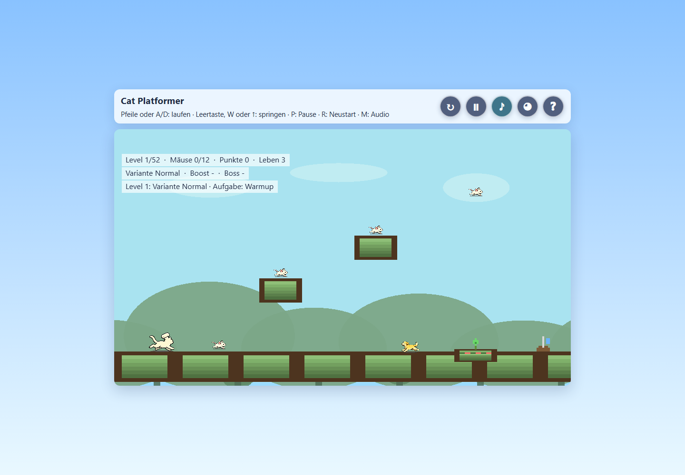
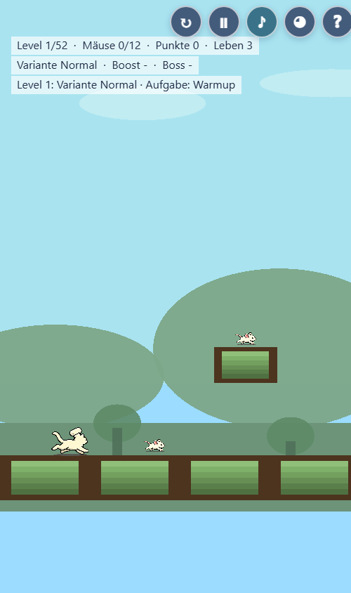
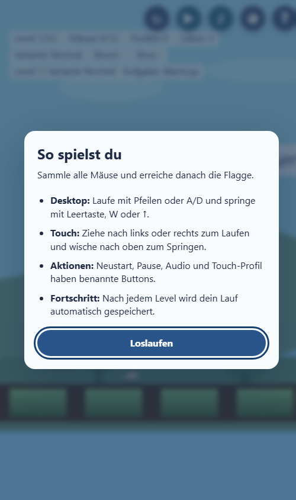

# Projektstatus und technisches Audit

Stand: 2026-08-05
Geprüfter Branch: `main`

## Kurzurteil

`cat-platformer` ist ein spielbarer, inhaltlich bereits breiter Phaser-Prototyp mit 52 Levels, Bossen, Modifikatoren, Challenges, adaptiver Schwierigkeit, Desktop-/Touch-Steuerung und mehrschichtiger Musik. Langzeitprogression und Einstieg sind inzwischen abgesichert; für eine belastbare Veröffentlichung fehlen vor allem eine schlankere Auslieferung, umfassendere Qualitätsprüfungen und eine wartbarere Modulstruktur.

Im geprüften Startzustand traten keine blockierenden Laufzeitfehler auf. Der wichtigste bestätigte Logikfehler lag im Levelgenerator: Der Zweig für zufällige Spring-Plattformen war unerreichbar. Dieser Fehler ist im ersten Maßnahmenblock behoben und automatisiert abgesichert worden.

## Umsetzungsstand nach dem ersten Maßnahmenblock

| ID | Status | Ergebnis |
|---|---|---|
| CAT-01 | erledigt | Generator ausgelagert, Spring-Zweig erreichbar, Level 3–52 deterministisch getestet |
| CAT-02 | erledigt | versionierter Save-State, explizites Fortsetzen/Neustarten und sicherer Fallback bei beschädigtem Storage |
| CAT-03 | teilweise erledigt | `package.json`, einheitlicher `npm run check`, Syntaxprüfung und 8 Tests ergänzt; Lint und CI fehlen noch |
| CAT-05 | begonnen | Levelgenerator, Persistenz und HUD-Texte als reine, browserunabhängig testbare Module aus `game.js` gelöst |
| CAT-06 bis CAT-09 | erledigt | First-run-Hilfe, semantische Controls, kompaktes Desktop-Layout und lesbare deutsche HUD-Texte umgesetzt |
| CAT-10, CAT-11 | erledigt | aktiver Lauf benötigt Neustartbestätigung; Audioauswahl wird fehlertolerant gespeichert |
| CAT-04, CAT-12 | offen | Asset-/Release-Pipeline sowie Betriebs- und Entwicklerdokumentation fehlen |

## Aktueller Aufbau

- Statische Webanwendung ohne Buildschritt; ein minimales Paketmanifest dient ausschließlich den Qualitätsprüfungen.
- Phaser 3.90.0 liegt vendort als `vendor/phaser.min.js` im Repository.
- Fast die gesamte Spiellogik liegt weiterhin in `src/game.js`; Levelgenerator, Persistenz und HUD-Texte sind als reine Module ausgelagert.
- Level 1 und 2 sind handgebaut; Level 3 bis 52 werden deterministisch generiert.
- Bosslevel erscheinen in Zehnerschritten.
- Desktop: Pfeiltasten oder A/D, Sprung über Leertaste/W/Pfeil hoch, Pause über P, Neustart über R, Audio über M.
- Mobile: Ziehen zum Laufen, Wischen zum Springen sowie semantische DOM-Schaltflächen.
- Persistiert werden Laufstand, Bestzeit, Touch-Profil, Audioauswahl und der Onboarding-Status; fehlerhafter oder blockierter Storage hat sichere Fallbacks.
- Die Veröffentlichung ist als statische Seite mit eigener Domain vorbereitet (`CNAME`).

## Durchgeführte Prüfungen

| Prüfung | Ergebnis |
|---|---|
| Git-Status und Upstream | sauber, `main` folgt `origin/main` |
| Qualitätsgate | `npm run check` erfolgreich |
| JavaScript-Syntax | `node --check` für Generator, Persistenz, HUD-Texte und Spiel erfolgreich |
| Modul-/Vertragstests | 8/8 erfolgreich; Generator, Persistenz, Neustart, HUD-Texte und semantische UI |
| Asset-Manifest | valides JSON |
| Desktop-Laufzeit, 1440 × 1000 | nach Änderungen erneut geladen und gerendert |
| Schmale Hochkantansicht, 500 × 844 | nach Änderungen erneut geladen und gerendert, Actions und Hilfe bleiben im Viewport |
| Laufzeitprotokoll | keine bestätigte Exception im geprüften Startablauf |
| Lint/CI | noch nicht vorhanden |

## Befunde

### P1 – vor weiterer Inhaltserweiterung

#### CAT-01 · erledigt: Zufällige Spring-Plattformen wurden nie erzeugt

Im ursprünglichen Levelgenerator prüfte `src/game.js` zuerst `roll > 0.94`, danach `roll > 0.86` und erst danach `roll > 0.96`. Der letzte Zweig konnte deshalb nie erreicht werden. Die Bedingungen sind nun disjunkt und absteigend geordnet.

Umsetzung: Der Generator liegt in `src/level-generator.js` und kann sowohl im Browser als auch direkt unter Node verwendet werden. Ein Test prüft Schwellwerte, deterministische Seeds, Struktur, sämtliche Plattformtypen und Bosslevel für Level 3 bis 52.

Akzeptanz: erfüllt.

#### CAT-02 · erledigt: Ein 52-Level-Lauf war nicht fortsetzbar

Ein Reload, Tab-Abbruch oder versehentlicher mobiler Neustart setzt den gesamten Lauf zurück. Bei 52 Levels ist das aus Anwendersicht ein hohes Frust- und Abbruchrisiko. Die Bestzeit wird erst am Ende des Gesamtlaufs gespeichert.

Maßnahme: Versionierten Save-State für Level, Punkte, Leben, Streaks und Laufzeit einführen; „Fortsetzen“ und „Neuer Lauf“ explizit anbieten.

Umsetzung: Nach jedem abgeschlossenen Level wird ein validierter Snapshot gespeichert. Beim nächsten Start zeigt ein semantischer Dialog Level, Leben, Punkte und Laufzeit und bietet „Fortsetzen“ oder „Neuer Lauf“. Inkompatible, beschädigte und blockierte Speicherzustände fallen kontrolliert auf einen neuen Lauf zurück.

Akzeptanz: erfüllt und mit Storage-/UI-Vertragstests abgesichert.

#### CAT-03 · teilweise erledigt: Automatisierte Absicherung

Zu Auditbeginn gab es weder Paketmanifest noch Test-, Lint- oder CI-Konfiguration. Generator, Challenge-Auswertung, Progression, Persistenz und Restart-/Pause-Zustände waren vollständig ungesichert.

Umsetzung: Minimales Node-Tooling, Syntaxprüfung und Generator-Unit-Tests sind vorhanden. Der aktuelle Browserstart wurde erneut manuell automatisiert geprüft. Ein dauerhaftes Browser-Smoke-Testpaket, Lint und CI bleiben offen.

Akzeptanz: Ein einzelner dokumentierter Befehl prüft Syntax, Lint, Unit-Tests und einen Start-/Input-/Restart-Smoke-Test; CI führt denselben Befehl aus.

#### CAT-04: Zu große und teilweise ungenutzte Assets

Das Projekt umfasst rund 56 MB. Allein Audio belegt 44,06 MiB; 30,32 MiB davon sind im aktuellen Manifest und Fallback nicht referenziert. Die potenziell verwendeten Audiodateien belegen weitere 13,74 MiB. Zusätzlich liegen bearbeitbare `.piskel`-Quellen im auszuliefernden Baum.

Maßnahme: Quell- und Laufzeitassets trennen, ungenutzte Dateien aus dem Deployment ausschließen und Musik für Webauslieferung komprimieren beziehungsweise lazy laden.

Akzeptanz: Definiertes Transferbudget für den Erststart; keine unreferenzierten Dateien im Deploy-Artefakt; Audio lädt erst nach Wahl beziehungsweise Nutzerinteraktion.

#### CAT-05 · begonnen: Monolithische Spiellogik

`src/game.js` bündelt Assets, Bootstrapping, Levelgenerierung, Physik, Gegner, Audio, Persistenz, Touch, HUD und Rendering. Das erhöht Änderungsrisiko und erschwert isolierte Tests.

Maßnahme: In kleinen Schritten in zustandsarme Module trennen: Konfiguration, Progression, Eingabe, Audio, HUD und Entitäten. Der Levelgenerator ist als erste getestete Grenze bereits ausgelagert.

Akzeptanz: Generator und Progression laufen ohne Browser/Phaser in Unit-Tests; `game.js` übernimmt überwiegend Komposition und Szenenlebenszyklus.

#### CAT-06 · erledigt: Mobile Onboarding-Anleitung wurde ausgeblendet

Unter 900 px blendet CSS die einzige explizite Steuerungsanleitung aus. Neue mobile Nutzer sehen sofort das Spiel und mehrere nicht beschriftete Symbole, erfahren aber nicht, dass Ziehen und Wischen erforderlich sind.

Umsetzung: Beim ersten Start erscheint ein nativer Hilfedialog mit Ziel, Desktop-/Touch-Eingaben, Aktionen und Save-Verhalten. Der Lauf pausiert dahinter; `?` öffnet die Hilfe jederzeit erneut. Der Gesehen-Status wird fehlertolerant gespeichert und kann mit `?help=1` bewusst überschrieben werden.

Akzeptanz: Ein Erstnutzer kann Laufen, Springen, Pause, Neustart, Audio und Touch-Profil ohne externe Erklärung finden.

#### CAT-07 · erledigt: Canvas-Bedienung war für assistive Technik nicht zugänglich

Mobile Aktionsflächen existieren ausschließlich als Phaser-Canvas-Objekte. Sie besitzen keine semantischen Namen, Fokusreihenfolge oder Tastaturbedienung. Das Canvas hat ebenfalls keinen Alternativtext.

Umsetzung: Neustart, Pause, Audio, Touch-Profil und Hilfe sind echte DOM-Buttons mit mindestens 44 Pixeln, Fokusindikator, ARIA-Namen und synchronisierten Zuständen. Die Spielfläche besitzt eine Textalternative und verweist auf die sichtbare Steuerungshilfe; Browserzoom bleibt erlaubt.

Akzeptanz: Alle Aktionen sind per Tastatur erreichbar und werden mit verständlichem Namen und Zustand von einem Screenreader angesagt.

### P2 – Produktpolitur und Betrieb

#### CAT-08 · erledigt: Desktop-Layout verschenkte viel Vertikalraum

Bei großen Viewports entsteht durch das Grid-Layout ein auffälliger leerer Bereich zwischen Anleitung und Spielfläche. Das Spiel wirkt dadurch kleiner und visuell vom Header getrennt.

Umsetzung: Header, Actions und Spielfläche liegen nun in einem gemeinsamen, zentrierten Container mit festem Abstand. Die Actions sitzen auf Desktop im Header und auf schmalen Viewports als sichere Overlay-Leiste.

#### CAT-09 · erledigt: HUD-Sprache war technisch und teilweise inkonsistent

Begriffe wie `Mod`, `Boost`, `Boss`, `Assist`, `Fokus` und `Challenge` stehen dicht in mehreren halbtransparenten Textzeilen. Deutsche Umlaute werden als `Maeuse`, `fuer` und `Druecke` ersetzt.

Umsetzung: Wiederholte HUD-Zeilen werden über ein getestetes Textmodul formatiert. `Mod` und `Challenge` heißen nun `Variante` und `Aufgabe`; Umlaute, Trennzeichen und Statusmeldungen sind konsistent und lesbarer.

#### CAT-10 · erledigt: Riskanter Sofort-Neustart auf Mobile

Der Neustart ist eine dauerhaft sichtbare Ein-Tap-Aktion. Ein Fehltipp kann einen langen Lauf ohne Bestätigung löschen.

Maßnahme: Während eines aktiven Laufs Long-Press oder kurze Bestätigung einsetzen; im Game-over-Zustand darf der Neustart direkt bleiben.

Umsetzung: Während eines laufenden Runs ist innerhalb von 2,5 Sekunden eine zweite Neustartaktion nötig. Game-over- und Siegzustände starten weiterhin direkt neu.

#### CAT-11 · erledigt: Audioauswahl wurde nicht gespeichert

Bestzeit und Touch-Profil sind persistent, Audio-Modus beziehungsweise Stummschaltung dagegen nicht.

Maßnahme: Audioeinstellung robust in `localStorage` speichern und bei nicht verfügbarem Storage auf einen sicheren Standard zurückfallen.

Umsetzung: Der aktive Audiomodus wird gespeichert, beim Start ohne Query-Override wiederhergestellt und bei blockiertem Storage sicher auf `primary` zurückgesetzt.

#### CAT-12: Betriebs- und Entwicklerdokumentation fehlt

Es gibt kein README mit Start, Steuerung, Debug-Parametern, Asset-Pipeline, Deployment oder Lizenzhinweisen.

Maßnahme: README und Asset-Lizenzinventar ergänzen; lokale Startanweisung und unterstützte Browser festhalten.

## Perspektiven

- Entwickler: Starker Funktionsumfang und erste getestete Modulgrenzen; der verbleibende Monolith und die begrenzte Verhaltensabdeckung machen Änderungen weiterhin riskant.
- UX: Kern, Fortsetzen und Einstieg sind verständlich; 52 Levels bleiben ein langes Commitment und spätere Progressionsbeats brauchen noch echte Durchlauftests.
- UI: Pixelstil und Szenen sind konsistent, Informationshierarchie und Desktop-Flächennutzung benötigen Überarbeitung.
- Anwender: Desktop-Steuerung ist sichtbar und verständlich; Mobileinstieg und 52-Level-Commitment sind die größten Hürden.
- Betrieb: Statische Auslieferung ist einfach, doch Assetgewicht, fehlende Qualitätsgates und fehlende Reproduzierbarkeit verhindern verlässliche Releases.

## Empfohlene Abarbeitung

1. Asset-Pipeline bereinigen, ungenutzte 30,32 MiB ausschließen und ein Transferbudget durchsetzen (`CAT-04`).
2. Qualitätsgate um Lint, Progressions-/Persistenztests, dauerhaften Browser-Smoke-Test und CI ergänzen (`CAT-03`).
3. `game.js` entlang getesteter Grenzen schrittweise modularisieren (`CAT-05`).
4. README, Lizenzinventar und Release-Checkliste abschließen (`CAT-12`).

## Browser-Nachweise

Desktop mit ausgeliefertem HUD und Spielfläche:

Schmale Hochkantansicht mit den fünf semantischen Actions:

First-run-Hilfe in der schmalen Hochkantansicht:

## Nicht geprüft / Restrisiken

- Kein vollständiger manueller Durchlauf aller 52 Levels.
- Keine reale Prüfung mit Screenreader oder physischem Touchgerät; Touch wurde nur emuliert.
- Keine Netzwerk-/CDN-Messung unter gedrosselter Verbindung.
- Keine Prüfung der Rechte an Audio-, Sprite- und Quellassets.
